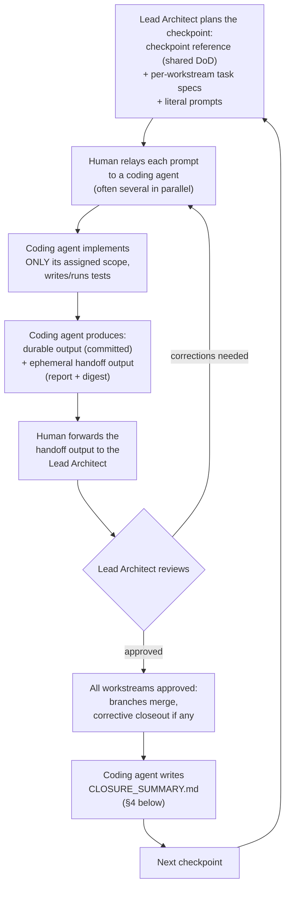

# AgentGate — Development Workflow

**Audience:** the Lead Architect (ChatGPT), the Senior Software Engineer (Claude), and the human
coordinator. This file is self-contained — paste it whole to a new Lead Architect session and it
should be enough to pick up exactly where things left off, with no other context required beyond
whatever checkpoint artifacts are shared alongside it.

**Status:** Canonical. This is the one place this workflow is described — `docs/DEVELOPMENT/AI_DEVELOPMENT_MODEL.md`
redirects here rather than duplicating it.

---

## 1. Roles

- **Lead Architect (ChatGPT):** architecture, planning, sequencing, external verification, review
  and approval of implementation, decision management. Does not write code. Does not need every
  detail solved before work starts — separates blocking decisions from evolvable detail.
- **Senior Software Engineer (Claude):** implementation, tests, local verification, reporting.
  Executes only the assigned scope. Never silently redesigns the system, never resolves an open
  architectural/security decision on its own — stops and escalates instead.
- **Human coordinator:** relays prompts and results between the two AIs in both directions, runs
  local verification when asked, makes the final call on anything escalated, owns the resulting
  code.

The objective is not maximum code generation. It is a correct, understandable, testable,
extensible codebase the human team actually owns and can review — never code that exists only
because an AI produced it and nobody since has verified what it does.

## 2. The checkpoint loop

Work proceeds as a sequence of checkpoints (**G1, G2, ... GN**), each covering one or more
parallel workstreams (e.g. Go Backend, Gateway/MCP, Frontend/UI, QA/Security, DevOps — adjust the
workstream set per checkpoint as the project actually needs).

1. **Plan.** The Lead Architect produces a checkpoint reference (the shared definition-of-done)
   and, per workstream, a detailed task spec plus the literal prompt to hand to a coding agent.
2. **Implement.** The human relays each prompt to a coding agent (often several in parallel, one
   per workstream, on their own branch). The agent implements only its assigned scope, tests it,
   and produces two distinct kinds of output — never blur them:
   - **Durable output** — typed contracts, security evidence, environment references, code.
     Committed to the repo; this is permanent project knowledge, referenced by later work.
   - **Ephemeral handoff output** — an implementation report and a condensed code digest, written
     for the human to forward to the Lead Architect. Never committed as permanent history, never
     referenced from code or from durable docs.
3. **Review.** The human forwards the ephemeral handoff output (plus any durable docs the Lead
   Architect asks for) to the Lead Architect, who reviews it — approves, or sends back concrete
   corrections, which the human relays for another implementation pass. Corrections that turn out
   to be real get a small corrective-closeout commit, not a silent rewrite of history; anything
   the reviewer flags but the engineer judges technically wrong gets pushed back on with
   reasoning, not blindly implemented.
4. **Close.** Once every workstream in the checkpoint is approved, its branches merge, any
   corrective closeout lands, and the coding agent writes one `CLOSURE_SUMMARY.md` for the
   checkpoint — see §4, the part of this workflow that exists specifically so the human side never
   loses track of what the AI actually built.

A coding agent must never silently redefine another workstream's contract, start a later
checkpoint's work, or resolve an open decision on its own.

## 3. Documentation conventions

`docs/README.md` is the map — read it before looking for anything. In short: core project context
rarely changes; status/decisions/security docs are living and rewritten in place, never appended
to; strategy has exactly one active plan at a time (older ones keep a "superseded by X" banner,
never deleted); each checkpoint gets `docs/PHASES/G{N}_WORKSTREAMS/` with the same shape every
time; anything under `docs/PHASES/archive/` is permanently historical.

## 4. Per-checkpoint codebase documentation — `CLOSURE_SUMMARY.md`

**Why this exists:** the code in this project is written entirely by AI. That is a deliberate
choice, not an excuse for anyone — human or AI — to stop understanding it. Nothing closes a
checkpoint until there is a document a human can read, without diffing every commit, that
explains what was actually built, how it fits together, and why it was built that way. If a
reviewer can't tell what changed and why from this document, the checkpoint is not done.

**Who writes it:** the coding agent (Claude), as the last step of closing a checkpoint, after
merge — same branch/PR the corrective closeout (if any) lands on.

**Where it lives:** `docs/PHASES/G{N}_WORKSTREAMS/CLOSURE_SUMMARY.md` — durable, committed, never
gitignored (unlike the per-workstream `results/` reports).

**Required sections:**

1. **What shipped** — one short paragraph, plain language, no jargon a new team member wouldn't
   have. What can the system do now that it couldn't before this checkpoint?
2. **Codebase walkthrough** — the actual point of this document:
   - At least one diagram (Mermaid — renders natively on GitHub and in most Markdown viewers)
     showing how the checkpoint's new pieces fit into the system: a component/architecture
     diagram, a sequence diagram of the main new flow, or both if that's clearer than one.
   - A map of what's new: which packages/files/services were added or meaningfully changed, and
     a sentence or two per item on what it's *for* — not a copy of the diff, an explanation.
   - The key design decisions made and **why**, in plain language — this is the specific defense
     against "vibecoded slop": every non-obvious choice gets a stated reason a reviewer can agree
     or disagree with, not just code that happens to work.
   - Trade-offs, known rough edges, or deliberately deferred work — stated, not hidden.
3. **Where to look** — direct pointers (file paths, entry points, one good test to read) for
   someone who wants to go read the real code after this summary, not instead of it.
4. **Decisions and carried-forward items** — what was decided during the checkpoint, and what
   open questions move to the next one (cross-reference `docs/DECISIONS/OPEN_DECISIONS.md`).

**Format is flexible, substance is not.** A Markdown file with inline Mermaid diagrams is the
default and satisfies this requirement on its own. If a particular checkpoint's result is worth a
nicer interactive or visual artifact (e.g. a published diagram set) that's a fine *addition*, not
a substitute — and it's an occasional judgment call, not a per-checkpoint obligation; doing it
every time would be exactly the documentation overhead this workflow otherwise tries to avoid.

**This is retroactive-friendly.** If a checkpoint closed before this convention existed, its
`CLOSURE_SUMMARY.md` gets written once the gap is noticed, same requirements, dated honestly.

## 5. Non-negotiables

- Fail-closed by default; schedule pressure never justifies weakening it.
- No silent scope expansion, no silent architecture change, no silently invented requirements.
- An open decision (`docs/DECISIONS/OPEN_DECISIONS.md`) is not an invitation to guess — resolve it
  through the Lead Architect, or build around it with an explicit interface, never past it.
- A discovery mid-task (bug, security issue, architecture change, requirement change, technical
  debt, implementation detail) gets classified and either fixed now, scheduled, or escalated —
  never silently absorbed into "just how it works now."
- Documentation and code move together. A task isn't done because it compiles; it's done when its
  acceptance criteria are met, tests pass, and required documentation — including, at checkpoint
  boundaries, `CLOSURE_SUMMARY.md` — is updated.
