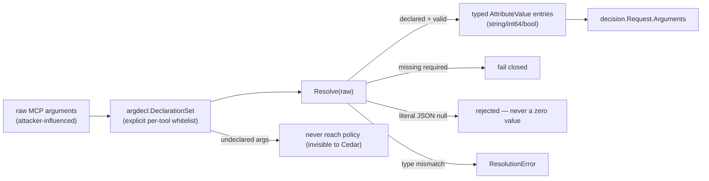

# Argument Authorization

Closed under open decision **O-006** (2026-09-13), this is the answer to a
genuinely hard question: *how do policy-relevant tool arguments reach Cedar
without turning arbitrary tool input into an uncontrolled policy surface?*

## The design: an explicit whitelist

Each tool declares its policy-visible arguments up front via a
`DeclarationSet` (`agentgate/internal/argdecl/argdecl.go`):

- every declaration has a **name**, a **type** (`string` | `int64` | `bool`),
  and **required/optional** status;
- `NewDeclarationSet` rejects duplicate, empty, or unknown declarations at
  construction time;
- **only declared arguments** are extracted and resolved into
  `decision.Request.Arguments`;
- **undeclared arguments are structurally invisible to Cedar** — a new or
  renamed argument can never quietly become a policy input.

## The resolution rules that matter (why null, why not defaults)

- **Explicit JSON `null` is rejected**, not coerced to `0`/`""`/`false`. That
  was a real bypass found independently by three workstreams during G1 —
  silently turning `amount: null` into `amount: 0` changed a deny into an allow.
- **Missing required arguments fail closed** (request denied).
- **Omitted optional arguments are absent** — the policy sees no fabricated
  default.
- Resolution produces **deterministic** `AttributeValue` entries that feed the
  frozen `decision.Request` contract.

## Assembly: putting it together (`internal/contextassembly`)

`contextassembly.Assemble(input)` (`internal/contextassembly/assembler.go:84`)
is the adapter that builds a validated `decision.Request` from three already
validated pieces:

1. a **pre-validated identity** (from `internal/identity`),
2. a **governance record** (from `internal/toolregistry`),
3. **resolved arguments** (from `internal/argdecl`).

It is fail-closed on every invalid input — empty execution/workspace id, empty
identity/roles, invalid or *drifted* governance record, bad argument types —
and sets `Classification.Known = true` with the governance-derived risk. It
explicitly documents that it does **not** solve O-008 (the ext_authz
transport-to-Request mechanism).

## Scope honesty

Closing O-006 resolves the *policy-input exposure model* — which arguments
become policy-visible and how. It does **not** mean argument-level
authorization is a fully deployed business-authorization system; Cedar policy
semantics determine the eventual decisions once the declared arguments reach
evaluation.