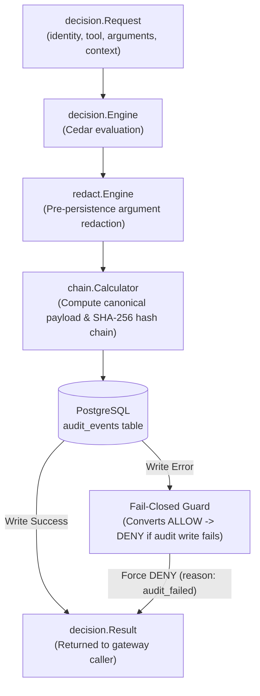

# Durable Audit Boundary (G5)

The **Durable Audit Boundary** (`internal/audit`) is AgentGate's append-only, tamper-evident record of authorization decisions. Implemented in **G5**, it resolves open decision **O-002** by guaranteeing that no tool call decision can take place without producing an immutable audit record — and that any failure in audit persistence causes the decision to **fail closed (`DENY`)**.

---

## Key Invariants

1. **Fail-Closed Audit Enforcement:** If audit persistence fails (e.g., database network drop, pool exhaustion, constraint violation), the decision service converts any preliminary `ALLOW` outcome into a hard `DENY` with reason `audit_failed`.
2. **Tamper-Evident SHA-256 Hash Chaining:** Every audit record incorporates a SHA-256 hash of its canonical payload combined with the `row_hash` of the immediately preceding event in that workspace.
3. **Pre-Persistence Argument Redaction:** Sensitive tool arguments are sanitized prior to database insertion according to per-tool redaction policies (`full`, `hash`, `omit`, or key-level masks). Unredacted sensitive data never hits disk.
4. **Database Immutability:** PostgreSQL triggers prevent any `UPDATE` or `DELETE` operations on the `audit_events` table at the database engine level.
5. **Privilege Separation:** The application database role (`agentgate_app`) is restricted to `SELECT` and `INSERT` privileges only; schema migrations run under a separate `agentgate_migrator` role.

---

## Data Flow & Architecture



---

## SHA-256 Hash Chaining & `ChainVerifier`

```text
row_hash(n) = SHA256(prev_hash(n-1) || canonical_payload(n))
```

- **Genesis Row (`n = 1`):** `prev_hash` is initialized to 64 zeros (`0000000000000000000000000000000000000000000000000000000000000000`).
- **Subsequent Rows (`n > 1`):** `prev_hash` equals `row_hash` of sequence number `n-1`.
- **Independent `ChainVerifier`:** The `verifier.go` package independently reads audit rows, recomputes canonical payloads and hash linkages, and asserts sequence integrity out-of-process. Any deleted, inserted, or modified row is immediately detected as a chain break.

---

## Pre-Persistence Argument Redaction

Argument redaction (`redact.go`) operates before persistence to enforce data privacy:

| Redaction Mode | Behavior |
|---|---|
| `full` | Replaces value with `"[REDACTED]"` |
| `hash` | Replaces value with `SHA256(salted_value)` |
| `omit` | Completely removes key from JSON structure |
| `sensitive-key` | Automatic mask applied to standard secret key names (e.g. `api_key`, `token`, `password`, `secret`) |

---

## Database Schema & Immutability Trigger

Implemented in [`internal/audit/migrations/002_create_audit_events.sql`](https://github.com/rushi-dynmsh/agentgate-dev/blob/main/agentgate/internal/audit/migrations/002_create_audit_events.sql):

```sql
CREATE TABLE IF NOT EXISTS audit_events (
    id BIGSERIAL PRIMARY KEY,
    workspace_id VARCHAR(128) NOT NULL,
    sequence_number BIGINT NOT NULL,
    execution_id VARCHAR(128) NOT NULL,
    timestamp TIMESTAMPTZ NOT NULL DEFAULT NOW(),
    event_type VARCHAR(32) NOT NULL DEFAULT 'decision',
    decision VARCHAR(16) NOT NULL,
    reason VARCHAR(64) NOT NULL,
    principal_agent_id VARCHAR(128) NOT NULL,
    principal_roles JSONB NOT NULL DEFAULT '[]'::jsonb,
    principal_on_behalf_of VARCHAR(128) NOT NULL DEFAULT '',
    tool_backend_id VARCHAR(128) NOT NULL,
    tool_name VARCHAR(128) NOT NULL,
    tool_risk VARCHAR(32) NOT NULL,
    policy_version VARCHAR(64) NOT NULL DEFAULT '',
    policy_hash VARCHAR(64) NOT NULL DEFAULT '',
    redacted_arguments JSONB NOT NULL DEFAULT '{}'::jsonb,
    canonical_payload TEXT NOT NULL DEFAULT '',
    prev_hash VARCHAR(64) NOT NULL,
    row_hash VARCHAR(64) NOT NULL,
    UNIQUE (workspace_id, sequence_number)
);

-- Immutability enforcement trigger
CREATE OR REPLACE FUNCTION prevent_audit_modification()
RETURNS TRIGGER AS $$
BEGIN
    RAISE EXCEPTION 'audit_events is immutable and append-only: UPDATE and DELETE are prohibited';
END;
$$ LANGUAGE plpgsql;

CREATE TRIGGER trg_prevent_audit_modification
BEFORE UPDATE OR DELETE ON audit_events
FOR EACH ROW EXECUTE FUNCTION prevent_audit_modification();
```

---

## Verification & Proof Suites

- **Unit & Property Tests:** [`internal/audit/chain_test.go`](https://github.com/rushi-dynmsh/agentgate-dev/blob/main/agentgate/internal/audit/chain_test.go), [`redact_test.go`](https://github.com/rushi-dynmsh/agentgate-dev/blob/main/agentgate/internal/audit/redact_test.go), [`service_test.go`](https://github.com/rushi-dynmsh/agentgate-dev/blob/main/agentgate/internal/audit/service_test.go).
- **QA Integration Suite (`agentgate/qa/g5audit`):** Asserts 9 DoD security invariants against a live PostgreSQL container in `deploy/g5`.
- **DevOps Topology (`deploy/g5`):** Reproducible Docker Compose environment with Postgres database privilege separation.
