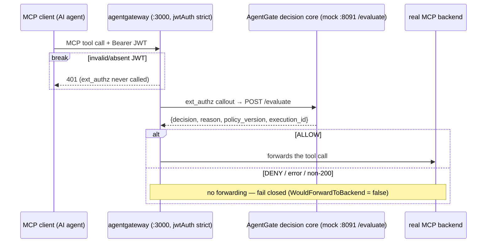

# Gateway Integration

The `gateway/` directory is the Gateway/MCP workstream's deliverable: a
reviewable `agentgateway` configuration for the intended production path, plus a
verification harness that proves the frozen decision contract end to end against
**the real mock**.

## The intended sequence



agentgateway validates the JWT **first** (strict mode) and only reaches
AgentGate afterwards; on any non-ALLOW outcome the call is **not** forwarded to
the backend. The `gateway/harness` module enforces exactly that gate:
`WouldForwardToBackend` (`gateway/harness/scenario.go:152`) is `true` **only**
when the response is HTTP 200 **and** the decision is `ALLOW`. There is no path
in it that turns a non-ALLOW outcome into forwarding.

## What's in `gateway/`

| Path | What it is |
|---|---|
| `config/g1-agentgateway.yaml` | The single governed route with `policies.extAuthz` calling AgentGate; a placeholder dev JWKS; an unreachable placeholder backend. No alternate bypass route exists — that is the "bypass check". |
| `harness/` | Independent Go module (own `go.mod`, zero dependency on `agentgate` code). It defines the wire response shape itself and asserts fixtures over real HTTP against the running mock. |
| `fixtures/` | 8 root wire fixtures: allow (`backend_reached: true`), explicit deny, no-matching-policy, missing identity, unknown tool, malformed argument, evaluation error, and a transport-level unknown-field case — plus G2 fixtures for identity claims and tool metadata. |
| `docs/` | G2 evidence: gateway inspection, ext_authz extraction evidence, the negative-enforcement (fail-closed) matrix, and the G6 handoff spec (future `internal/authz` wiring). |

## Running the harness

```bash
# Terminal 1 — the real mock (wraps the REAL decision engine + Cedar)
cd agentgate
go run ./cmd/g1-mock-authz            # :8091 by default

# Terminal 2 — the automated interoperability proof
cd gateway/harness
go test ./... -v                      # skips (with instructions) when the mock is down

# Human-readable report table over the same fixtures
go run ./cmd/g1report
```

## The O-008 gap (read before relying on this path)

The mock's `POST /evaluate` expects AgentGate's **bespoke JSON body** —
`{execution_id, workspace_id, identity, tool, classification, arguments}`.
agentgateway's documented `ext_authz` mechanisms — its HTTP variant
(`path`/`addRequestHeaders`/`includeResponseHeaders`/`redirect`, all CEL
expressions over URL/headers) and its gRPC variant (Envoy `CheckRequest`) —
have **no documented field that constructs that arbitrary JSON body**. This
"contract-mismatch finding" is recorded in `gateway/README.md` (verified against
the real binary) and is **open decision O-008** in
[`docs/DECISIONS/OPEN_DECISIONS.md`](https://github.com/rushi-dynmsh/agentgate-dev/blob/main/docs/DECISIONS/OPEN_DECISIONS.md).

The design intent (not yet built): the future `internal/authz` ext_authz layer
owns the translation from agentgateway's native callout into a
`decision.Request` (presumably by parsing the *included request body* itself).
The rule in force: **no workstream may invent a gateway-side adapter/shim to
bridge this gap** — that would create a second, competing contract-mapping
outside the component that must own it.

Until `internal/authz` exists, the direct-HTTP mock/harness pattern is the
officially allowed contract-testing path.