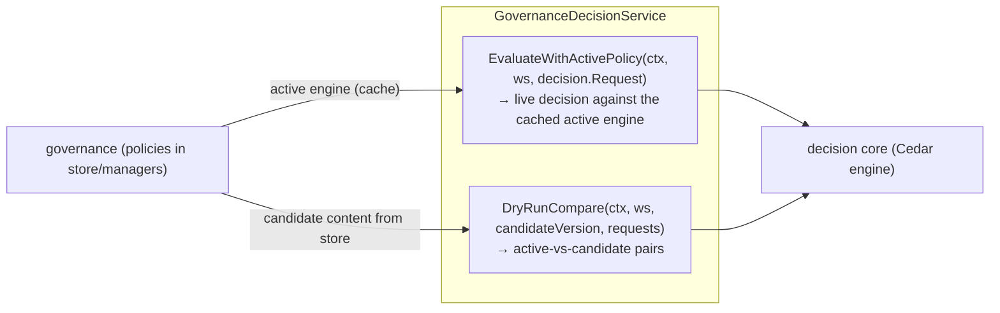

# Governance ↔ Decision Integration

Checkpoint G4's workstream-boundary achievement: proving that a *persisted
policy change actually changes decisions*, through the real decision core,
without mutating the active policy.

## The bridge (`internal/governanceintegration`)

`GovernanceDecisionService` (`internal/governanceintegration/integration.go:22`)
connects the two halves of the product:



- **`EvaluateWithActivePolicy`** evaluates a `decision.Request` against the
  policy manager's cached active engine — this is the path a future
  request-time gateway integration would call. With no active policy it denies
  with `no_policy_loaded` (fail-closed; no fabricated version).
- **`DryRunCompare`** loads the *candidate* content from the store, builds a
  fresh engine for it, and evaluates the same requests against **both** the
  active and the candidate engine. The active engine is never touched — dry-run
  isolation is structural, not best-effort.

## The dry-run endpoint

`POST /api/v1/workspaces/{id}/policies/{version}/dryrun`
(`internal/govapi/handler.go:258`) converts governed sample requests into
`decision.Request`s and returns, per request:

```text
DryRunComparison {
  active_decision, active_reason, active_policy_version,
  candidate_decision, candidate_reason, candidate_policy_version,
  changed            // decision OR reason differs
}
```

The `changed` flag is what an operator sees as *"9 previously-denied calls
would now be allowed (listed); 3 previously-allowed would now be denied
(listed)."* That preview-before-activation is the whole point of the product.

## Isolation guarantees (what tests pin)

- Dry-run **never** changes the active version — the store is read-only on this
  path.
- Activation failure is atomic — a failed activate leaves the previous active
  policy fully intact (both store and cached engine).
- Cache coherence — after activation/rollback the cached engine exactly matches
  the store's active version; concurrent readers see only old-valid or
  new-valid.

## Next

- [Gateway integration](./gateway-integration.md) — where this decision the
  loop is meant to sit in the real MCP path.