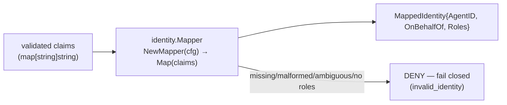
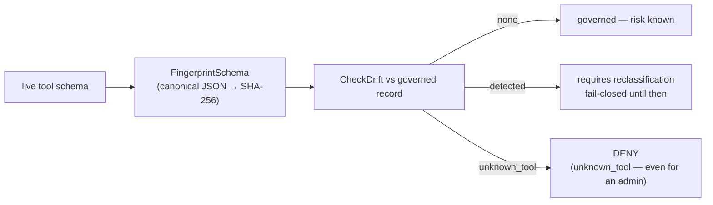

# Identity and Tool Governance

These two components (checkpoint G2) turn the two things AgentGate structurally
*trusts* at the decision boundary — an identity and a tool reference — into
typed, fail-closed inputs.

## Identity: claims → mapped identity (`internal/identity`)

AgentGate does **not** verify JWTs — agentgateway already did that. AgentGate
consumes the validated claims (as a `map[string]string`) and maps them into a
typed identity:

- `agent_id` — the calling agent (required, non-empty)
- `on_behalf_of` — the human the agent acts for (optional; must not equal the agent id)
- `roles` — space-separated string, parsed into a non-empty list with no blank
  entries

The mapper supports custom claim names via a `MapperConfig` (the G2 fixtures
show `okta_oidc` / `azure_ad` profiles) and **denies fail-closed** through four
explicit failure classes
(`internal/identity/mapper.go:39`): `ErrMissingClaim`, `ErrMalformedClaim`,
`ErrAmbiguousIdentity` (e.g. on_behalf_of == agent_id), `ErrMissingRoles`.

## Tool governance: identity, risk, fingerprint, drift (`internal/toolregistry`)

Tool governance is where an operator's *intent* is captured: which tools exist,
how risky they are, and what their schemas look like.

- **Tool ID** = `BackendID + "/" + ToolName` — a tool is identified by its
  backend *and* name; the same name on a different backend is a different tool
  (no same-name inheritance).
- **Risk level** — `read` | `write` | `destructive`, assigned explicitly. Risk
  is an operator decision; it can never be inferred from the tool's name.
- **Schema fingerprinting** — `FingerprintSchema` produces a deterministic
  SHA-256 of the tool's *canonicalized* JSON schema, so formatting noise never
  changes the fingerprint.
- **Drift detection** — `CheckDrift` compares the live tool schema against the
  governed record: `none` (matches), `detected` (schema changed → governance
  review required), or `unknown_tool` (not in the registry). A changed schema is
  exactly the moment a tool could change what it does — fail-closed behavior
  applies until reclassified.
- **Governance record validation** — `GovernanceRecord.Validate()` enforces the
  invariants (known tool ⟺ has a risk; fingerprint consistency).

## How they feed the decision core

Neither component decides on its own — they produce the *inputs* to
[Argument authorization](./argument-authorization.md)'s assembler, which builds
a validated `decision.Request`. The rule that matters: any failure in identity
resolution or tool governance surfaces as a **DENY before Cedar is ever
consulted**.