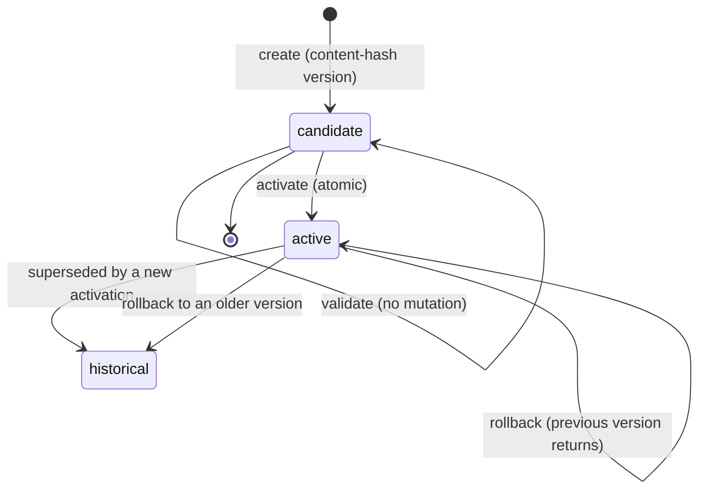

# Policy Lifecycle

Versioned policies, atomic activation, rollback, preview, and dry-run
comparison. This is the product's core differentiator: turning "edit and hope"
into "see the effect before it ships."

## State model

A policy `version` is **content-addressed** — the hex SHA-256 of its source
text — so the same text is always the same version, and provenance never
depends on where the text came from.

## Persistence (`internal/policystore`)

The `Store` interface (`store.go:10`) is implemented twice, sharing a single
behavior test:

- **`MemoryStore`** (`memory.go:11`) — mutex-guarded in-memory map; the default
  runtime (no `AGENTGATE_DATABASE_URL`).
- **`PostgresStore`** (`postgres.go:19`) — pgx/v5 pool; `Migrate()` applies the
  embedded schema
  (`internal/policystore/migrations/001_create_policies.sql`, loaded via
  `go:embed`) in a transaction and records the applied version.

The schema enforces the core invariant at the **database level**: a partial
unique index (`idx_policies_unique_active … WHERE state = 'active'`) guarantees
**at most one active policy per workspace**. Activation and rollback run in
transactions with existence checks; a Postgres unique violation on create maps
to `ErrAlreadyExists`.

## Orchestration (`internal/policymanager`)

The manager holds a **concurrency-safe cache of the active Cedar engine per
workspace** and orchestrates the lifecycle:

| Operation | Semantics |
|---|---|
| `Validate(content)` | Parse/validate Cedar syntax, no persistence. |
| `CreateCandidate(content, …)` | Store as `candidate`; idempotent on content hash (same text → existing version returned). |
| `Activate(version)` | Syntax-validate first, store activation (previous active demoted to `historical` atomically in the store), **then atomically swap the in-memory engine pointer under the mutex**, emit an `activate` mutation event. |
| `Rollback(targetVersion)` | Store rollback (previous active demoted), swap the cached engine back, emit a `rollback` event. |
| `Preview(version, inputs)` | Batch-evaluate sample inputs against *any stored version* — read-only, no mutation. |
| `GetActiveEngine` | The engine readers actually use for decisions. |
| `LoadActivePolicies` | Startup: rebuild the cache from the store. |

The atomic swap is the guarantee behind invariant
[PRODUCTION-INVARIANTS §4](https://github.com/rushi-dynmsh/agentgate-dev/blob/main/docs/SECURITY/PRODUCTION-INVARIANTS.md):
**readers see either the previous valid policy or the newly-activated valid
policy, never a partially-loaded one.** A failed activation leaves the
last-known-good active.

## Mutation audit events (`internal/auditevents`)

G4 added the audit plumbing: `MutationEvent`/`MutationListener`
(`internal/auditevents/events.go:25/37`) with three action kinds — `activate`,
`rollback`, `create_candidate`. Default is a no-op listener; a
`RecordingListener` exists for tests; the durable persistence is a later gate.

## Preview vs dry-run — same spirit, different surface

| | `Preview` | `DryRunCompare` |
|---|---|---|
| What it runs | sample `EvalInput`s against one chosen stored version | identical requests against **active AND candidate** |
| Where | `policymanager.Preview` | `governanceintegration.DryRunCompare` + `POST /policies/{version}/dryrun` |
| Output | per-input results for that version | per-request `active_decision/reason/version` vs `candidate_…` + `changed` flag |
| Mutation | none — read-only | none — the active engine is never touched (isolated) |

## Fail-closed startup

If no active policy is loaded at startup, decisions deny with
`no_policy_loaded` — there is no "startup with nothing loaded → allow"
path.

## Next

- [Governance API](./governance-api.md) — the REST surface that drives this lifecycle.
- [Governance↔Decision integration](./governance-decision-integration.md) — how persisted policy changes are proven to affect decisions.