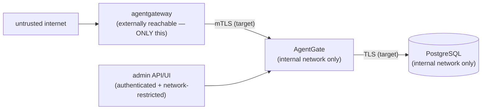

# Security Model

> The binding security document is
> [`docs/SECURITY/PRODUCTION-INVARIANTS.md`](https://github.com/rushi-dynmsh/agentgate-dev/blob/main/docs/SECURITY/PRODUCTION-INVARIANTS.md).
> No later work may contradict it without an explicit, recorded exception. This
> page is a navigable summary **only**.

## Default posture: fail closed

AgentGate is in-path authorization. Its default behavior is fail-closed:
missing/invalid identity → DENY; unknown/unclassified tool → DENY; missing
policy → DENY; Cedar evaluation error → DENY; malformed input can never produce
ALLOW; audit-durability failure → DENY. "No policy loaded → allow" or "state
unclear → allow" do not exist as code paths.

## Trust boundary

- agentgateway owns MCP transport, routing, tool discovery, and inbound **JWT
  validation**. AgentGate is trusted *only* when reached through that
  authenticated gateway→service boundary — AgentGate is not a public MCP
  endpoint and does not speak MCP.
- A direct or unauthenticated caller to the decision service is **not** a
  trusted request.
- Exposing AgentGate's decision or admin surface directly to untrusted networks
  is a deployment-topology defect, regardless of what authentication is layered
  on top.

## What these invariants mean in code today

- **The frozen decision core trusts no caller** — `decision.Engine` does no
  signature verification; trust is structural (only the future `internal/authz`
  layer is a legitimate producer of `Identity`). The mock is explicitly a
  test/integration path.
- **`policy_version` is never fabricated** — every result carries the exact
  SHA-256 evaluated, or `""` only when Cedar was genuinely unreached.
- **Unknown/Cedar-rejected outcomes can't reach the backend** — the gateway
  harness's `WouldForwardToBackend` gate is provably all-or-nothing.
- **Admin surface is authenticated** — every policy-mutation endpoint requires
  the admin key via constant-time comparison; unauthenticated → 401.
- **Schema-level race prevention** — Postgres enforces at most one active
  policy per workspace, and the in-memory engine swap is atomic under a mutex.

## Identity invariants (downstream credentials)

The inbound bearer token is **never** a downstream credential. AgentGate must
never forward the received token to a downstream MCP server "under any
circumstance, including as a temporary shortcut." The *replacement mechanism* is
open decision **O-001** (critical) — check
[Open decisions](../development/open-decisions.md) before implementing anything
in this area.

## Audit invariants (G5 Durable Audit Boundary — O-002 Resolved)

Every ALLOW and DENY decision provably produces a **durable, append-only, tamper-evident** audit outcome in PostgreSQL (`internal/audit`). Open decision **O-002** is resolved:

- **Fail-Closed Enforcement:** Any audit write or persistence failure immediately converts an `ALLOW` decision into a `DENY` (`audit_failed`).
- **Cryptographic Chain Verification:** Events form a SHA-256 hash chain per workspace; independent `ChainVerifier` asserts sequence continuity.
- **Data Privacy & Redaction:** Sensitive tool arguments are sanitized prior to persistence (`full`, `hash`, `omit`, key overrides).
- **Engine-Level Immutability:** PostgreSQL triggers reject any `UPDATE` or `DELETE` on `audit_events`.
- **Privilege Separation:** Application connections (`agentgate_app`) hold `SELECT`/`INSERT` only.

See [Durable Audit Boundary](./durable-audit.md) for full architectural details.

## Open security-adjacent questions

- **O-001** — downstream identity/credential mechanism (critical).
- **O-003** — agentgateway conformance/security boundary (must be verified by
  integration tests, not assumed).
- **O-008** — ext_authz transport mapping to `decision.Request` (the gateway
  contract-mismatch gap).

All of these live in
[`docs/DECISIONS/OPEN_DECISIONS.md`](https://github.com/rushi-dynmsh/agentgate-dev/blob/main/docs/DECISIONS/OPEN_DECISIONS.md).
Open decisions are not invitations to guess — if work runs into one, stop that
decision-dependent part and record the conflict.