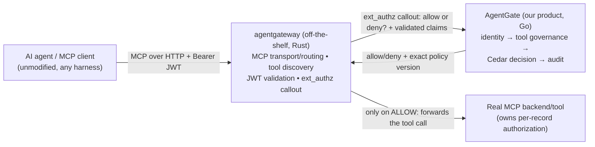
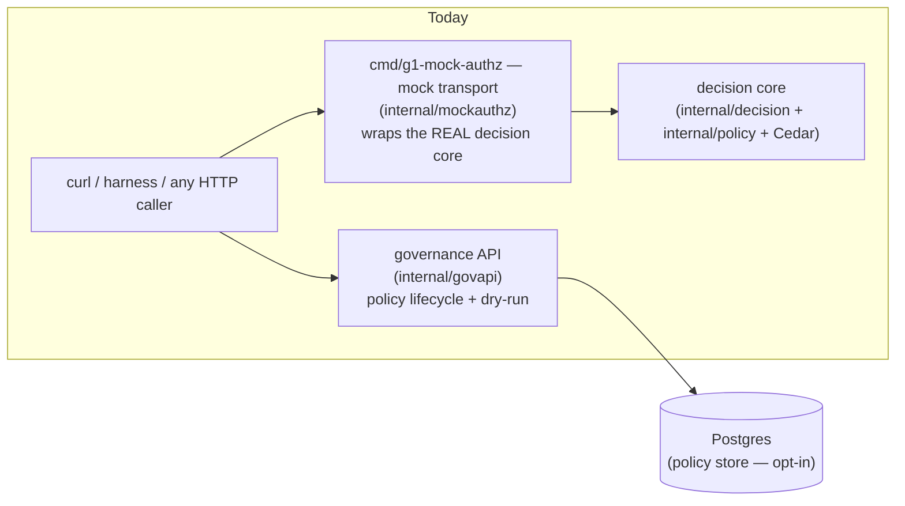
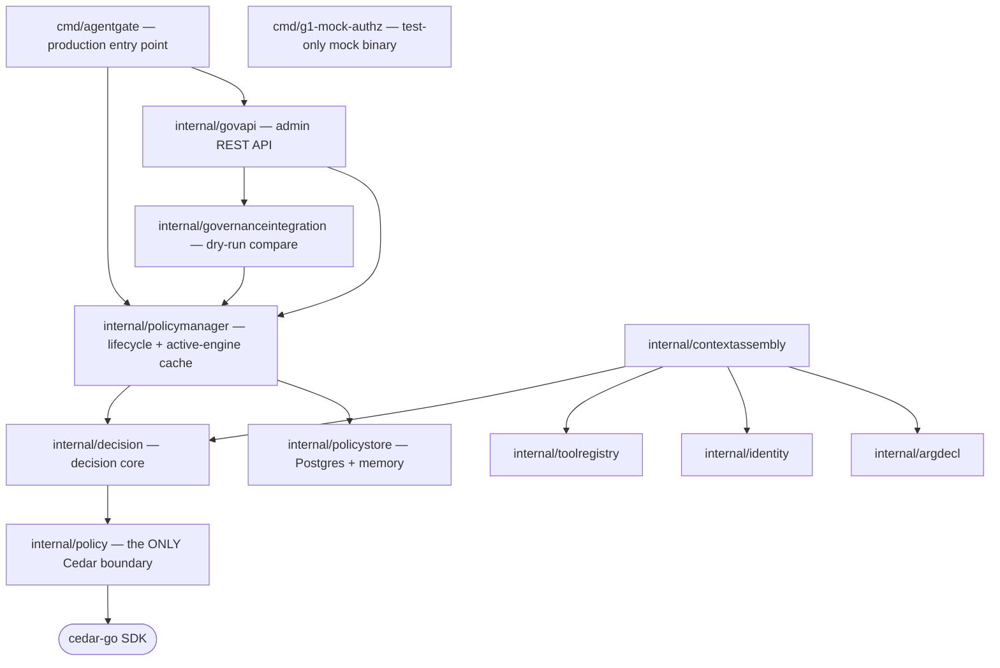

# System Overview

## The intended production path

AgentGate is an in-path authorization decision point sitting behind
[agentgateway](https://agentgateway.dev) (the MCP data-plane proxy). The
division of labour is the load-bearing design constraint: **agentgateway owns
the MCP transport; AgentGate owns identity resolution, policy, and audit; the
tool/backend owns per-record authorization.**

- **agentgateway** is the only externally-reachable component. It validates the
  inbound JWT (`jwtAuth`, strict mode) and calls AgentGate **before** forwarding
  a governed tool call.
- **AgentGate** never speaks MCP and is not a public endpoint. Its decision
  surface and admin API are internal-network-only
  ([PRODUCTION-INVARIANTS §9](https://github.com/rushi-dynmsh/agentgate-dev/blob/main/docs/SECURITY/PRODUCTION-INVARIANTS.md)).
- **Robustness consequence:** AgentGate down = governed calls denied. Fail-closed
  is a deliberate choice, not an accident.

## What exists today vs. the target

The current codebase (checkpoint G4, see
[Current Status](../development/current-status.md)) implements the **AgentGate
side** of this diagram and proves its contract with a JSON/HTTP mock. The real
`ext_authz` gRPC boundary (`internal/authz`) is *not built yet* — it is a
documented placeholder. Today's verified flows:

The product's decision logic is real; the *transport* to it in production
(gRPC ext_authz) is the remaining work. The mock is explicitly temporary
(execution-plan Rule 2: mocks are parallelization tools, never permanent
substitutes).

## Backend layering (how the Go module is organized)

The `agentgate` module is deliberately layered so only one package ever touches
the Cedar SDK:

One-package Cedar confinement is a security design, not an accident: policy
types that cross into `internal/decision` are pure-Go value types, and the Wire
contract is JSON — nothing Cedar-specific leaks outward.

## Trust model in one breath

AgentGate trusts the identity fields on a decision request **structurally** —
the only legitimate production caller is the future `internal/authz` layer,
which will populate them from claims that agentgateway already
cryptographically validated. Every other path (including the mock) is an
unauthenticated test/integration path by definition. This is documented in the
[G1 contract](https://github.com/rushi-dynmsh/agentgate-dev/blob/main/docs/PHASES/G1_WORKSTREAMS/GO_BACKEND_G1_CONTRACT.md)
and enforced by fail-closed rules at every layer.

## Next

- [Components](./components.md) — a package-by-package map of the Go module.
- [Security model](./security-model.md) — the binding invariants.
- [Gateway integration](./gateway-integration.md) — agentgateway config and the contract-mismatch finding (open decision O-008).