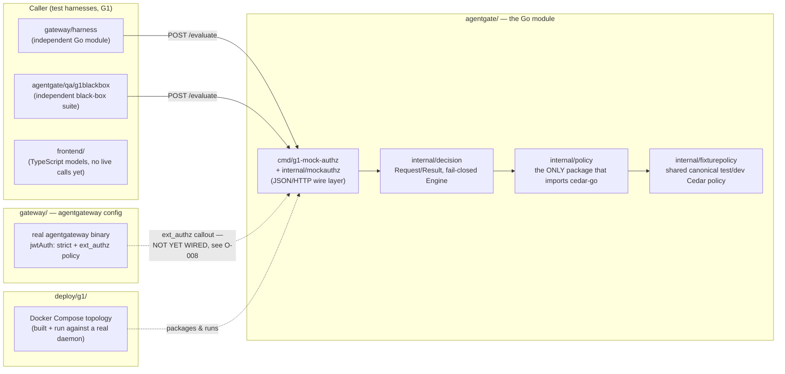

# G1 Closure Summary — Authorization Contract Freeze

**Checkpoint status:** PASS / CLOSED / FROZEN (Lead Architect verdict, 2026-09-12)
**Written:** 2026-09-13, retroactively — this convention (`/WORKFLOW.md` §4) didn't exist when G1
closed. Same requirements applied honestly after the fact, not relaxed for being late.

## 1. What shipped

AgentGate can now make a real, fail-closed authorization decision. Given a caller's identity,
roles, the tool they're trying to invoke, and its risk classification, the system decides
ALLOW or DENY using an actual Cedar policy engine — not a stub — and every failure mode (missing
identity, unclassified tool, malformed input, a broken policy) reliably denies rather than
accidentally allowing. This decision core is exercised over real HTTP by an independent test
suite, by a real `agentgateway` instance (schema-validated and running against the real binary),
by a TypeScript model layer ready for a future UI, and by a real Docker container — five
independent workstreams converged on one frozen contract with no disagreement about its shape.

## 2. Codebase walkthrough

### 2.1 How the pieces fit together

The dotted line is deliberate: `agentgateway`'s `ext_authz` callout does **not** yet reach the
mock automatically. That gap is real, understood, and tracked (§4) — not hidden by the diagram.

### 2.2 What's new, and what it's for

| Location | Purpose |
|---|---|
| `agentgate/internal/decision/` | The frozen contract: `Request`/`Result` types, and `Engine.Evaluate` — the one function that turns a request into ALLOW/DENY, deterministically, and never returns ALLOW on any failure path. |
| `agentgate/internal/policy/` | The Cedar boundary. Every other package in this module is Cedar-free; if you ever see `cedar-go` imported anywhere else, that's a boundary violation. |
| `agentgate/internal/fixturepolicy/` | One shared Cedar test policy (roles: reader/admin/payer/broken; risks: read/write/destructive), used by every test suite in G1 so they're all provably testing the same behavior, not five slightly-different copies. |
| `agentgate/internal/mockauthz/` + `cmd/g1-mock-authz/` | Wraps the *real* `internal/decision.Engine` in JSON over HTTP. This is not a fake — it's the real Cedar-backed engine behind a throwaway transport, built solely so other workstreams could integrate before the production `ext_authz` gRPC service exists. Never reachable from `cmd/agentgate` (the real production binary). |
| `agentgate/qa/g1blackbox/` | 37 tests that import *no* `internal/*` package — a genuinely independent check that the contract behaves as documented, not just as implemented. |
| `gateway/` | An `agentgateway` configuration, schema-validated and actually run against the real binary (not just written and assumed correct), plus its own Go module (`gateway/harness`) proving the contract over real HTTP. |
| `frontend/` | Typed TypeScript models/parsing/state-machine mirroring the Go contract exactly, with fixtures for every decision/reason/error/stale state — no live backend calls yet, no framework chosen yet (deliberately deferred, see §3). |
| `deploy/g1/` | A Docker Compose topology for the mock, built and run against a real Docker daemon — not just written and left unverified. |

### 2.3 Key design decisions, and why

- **A new `internal/decision` package, not `internal/authz`.** `internal/authz` was already
  reserved (since Day 1) for the real `ext_authz` gRPC service that doesn't exist yet. Putting the
  decision core there would have meant either building the gRPC service prematurely or
  overloading a package name with two unrelated jobs. Keeping them separate means `internal/authz`
  can later just *call* `internal/decision` — no rework needed.
- **The mock wraps the real engine instead of faking responses.** A hand-rolled fake that returns
  canned JSON would test the *shape* of the contract but never prove Cedar itself behaves as
  claimed. Wrapping the real `Engine` means every G1 test — Gateway's, QA's, DevOps's — is
  actually exercising Cedar, not a stand-in for it.
- **Trust provenance is a documented invariant, not a struct field.** `decision.Request` has no
  "how was this identity verified" field. Adding one would have encoded something structurally
  true of every legitimate caller (only the real `ext_authz` layer should ever populate this) as
  if it varied per-request, when it doesn't yet — a field with no real v1 purpose. Documented
  instead, explicitly flagged as open to disagreement (see `GO_BACKEND_G1_CONTRACT.md`).
- **A single fixed Cedar action (`InvokeTool`), not one per operation type.** v1 governs exactly
  one kind of thing — calling a tool — so modeling multiple action types now would be speculative
  complexity with no current consumer.

### 2.4 What was found wrong, and fixed — the concrete proof review matters

Two real bugs were independently discovered by three separate reviews (a code review, the QA
workstream, and the Frontend workstream) after G1's initial implementation:

1. A JSON `null` value for a declared argument was silently treated as that type's zero value
   (`0`/`""`/`false`) instead of being rejected — proven capable of turning a real DENY into an
   ALLOW under a threshold-based policy rule.
2. The wire response used `omitempty`, silently dropping the `message`/`policy_version` fields
   from the JSON instead of always emitting them as the frozen contract's own documented examples
   showed.

Both are fixed (commit `edefea6` on `g1/go-backend`, later merged), with regression tests added
for each. This is the point of the workflow's review step: neither of these was "wrong code that
doesn't run" — both looked fine and passed every existing test until specifically probed.

### 2.5 Trade-offs and known rough edges

- No real signed-JWT request was ever driven end-to-end through the real `agentgateway` — the
  dev JWKS fixture deliberately has zero keys, so nothing could validate. `agentgateway`'s JWT
  enforcement was confirmed independently instead (a bare unauthenticated request correctly gets
  `401`).
- `go test -race` has not been run in the actual local development sandbox at any point in G1 (no
  cgo/gcc there); it does run in CI.
- The DevOps Compose topology's `agentgateway`/`mcp-client` services are explicit stub
  placeholders — only `mock-authz` is real.

## 3. Where to look

Start at `docs/PHASES/G1_WORKSTREAMS/GO_BACKEND_G1_CONTRACT.md` for the full field-by-field
contract, then read code in this order:
1. `agentgate/internal/decision/types.go` — the contract itself.
2. `agentgate/internal/decision/engine.go` — the fail-closed evaluation logic, especially
   `Evaluate`'s ordering (structural checks → identity → tool classification → policy).
3. `agentgate/qa/g1blackbox/blackbox_test.go` — the single best file for seeing the whole decision
   matrix exercised end-to-end, since it doesn't import any internal package and reads like a
   spec.

## 4. Decisions and carried-forward items

- **Resolved during G1:** the null-argument coercion bug and the `omitempty` contract-drift bug
  (§2.4), and the `Classification.Risk`-required-when-known gap — all fixed, with regression
  tests, not just documented as findings.
- **Carried forward, not resolved (deliberately):** `docs/DECISIONS/OPEN_DECISIONS.md` **O-008** —
  how a real `ext_authz` callout (HTTP or gRPC) becomes a `decision.Request` is undesigned; the
  dotted line in §2.1's diagram is exactly this gap. This is explicit, tracked architectural work
  for whichever checkpoint builds the real `internal/authz` — not something G1 was expected to
  close, and not something anyone should quietly work around.
- Production UI framework choice (Frontend) remains open, by design.
