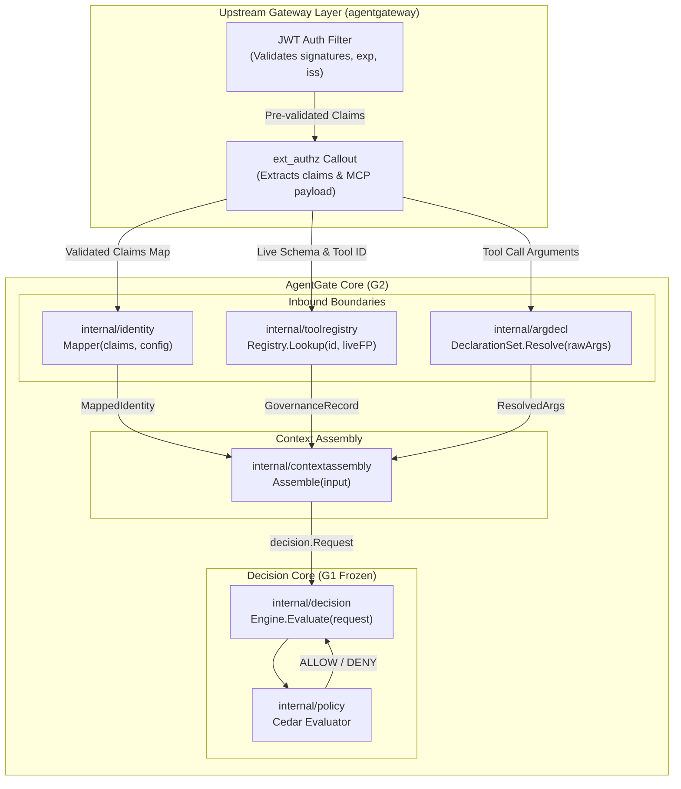

# G2 Closure Summary — Identity Mapping, Tool Registry & Typed Invocations

**Checkpoint status:** PASS / CLOSED  
**Date:** 2026-09-13 (corrective closeout applied 2026-09-13)  
**Branch:** `development`  

---

## 1. What Shipped

Checkpoint G2 extends AgentGate from G1's static decision core into a production-oriented context assembly boundary. In G1, requests arrived with pre-formed `Identity`, `Classification`, and `Arguments`. G2 establishes the authoritative pipelines that construct those inputs from real external signals, fail closed on any ambiguity or drift, and guarantee that unclassified tools, undeclared arguments, or unverified claims can never reach policy evaluation. **Note:** G2 components are independently implemented and tested; full production E2E integration through the actual ext_authz data path remains pending until G6 (O-008).

Five workstreams converged on the G2 checkpoint without contract drift or permissive defaults:

1. **W1 — Go Backend (Commit `c6a5acf`):**
   - `internal/identity`: Config-driven mapper converting gateway-validated claims to typed `MappedIdentity`. 4 failure classes (`ErrMissingClaim`, `ErrMalformedClaim`, `ErrAmbiguousIdentity`, `ErrMissingRoles`).
   - `internal/toolregistry`: Authoritative tool identity model `(BackendID, ToolName)`. Same tool name on different backends is distinct. Canonical SHA-256 schema fingerprinting and drift detection (`DriftNone`, `DriftDetected`, `DriftUnknownTool`).
   - `internal/argdecl`: Whitelist of typed argument declarations (`string`, `int64`, `bool`). Rejects explicit JSON null (no zero-coercion bypass). Omitted optional arguments are absent; missing required arguments fail closed. Undeclared arguments are ignored.
   - `internal/contextassembly`: Adapter combining identity, governance record, and arguments into `decision.Request`.
   - `internal/g2fixtures`: Cross-workstream shared durable fixtures.

2. **W2 — Gateway / MCP (Commit `f7eb783`):**
   - `gateway/fixtures/g2/identity_claims.json`: Test claims for minimal, delegated, and failure cases.
   - `gateway/fixtures/g2/tool_metadata.json`: Authoritative tool metadata and computed SHA-256 schema fingerprints.
   - `gateway/docs/G2_GW_INSPECTION.md`: Verified facts vs hypotheses.
   - `gateway/docs/G2_MCP_EXTRACTION_EVIDENCE.md`: MCP protocol parsing evidence; O-008 explicitly open.
   - `gateway/docs/G2_NEGATIVE_ENFORCEMENT.md`: JWT-before-ext_authz behavior analysis.
   - `gateway/docs/G2_G6_HANDOFF.md`: Sequence diagram and per-hop contracts for the G6 integration checkpoint.

3. **W3 — Frontend / UI (Commit `ffb02cd`):**
   - Framework-agnostic TypeScript model layer mirroring Go contracts: `identity-governance.ts`, `tool-inventory.ts`, `argument-declaration.ts`.
   - Zero raw credential or token storage.
   - Fail-closed governance derivation (`unknown`, `drifted`, `missing_risk`, `stale`).
   - Deterministic fixtures in `frontend/src/fixtures/g2/`.
   - 54 passing Vitest tests (17 new G2 tests + 37 G1 regression tests) and clean TypeScript typechecking (`tsc --noEmit`).

4. **W5 — DevOps / Release Engineering (Commit `d1d4907`):**
   - `deploy/g2/identity-mapping.yaml`: Non-secret, configurable claim mapping example.
   - `deploy/g2/governance-fixtures.yaml`: Deterministic tool and argument fixtures.
   - `deploy/g2/negative-configs/`: Negative security configs covering missing claims, conflicting claims, missing risk, invalid fingerprint, duplicate declarations, and invalid types.
   - `agentgate/internal/config/negative_config_test.go`: Automated tests proving negative configs fail closed.
   - `deploy/g2/Dockerfile.agentgate` & `deploy/g2/docker-compose.yml`: Test topology.
   - `.github/workflows/ci.yml`: Frontend validation job added without weakening Go gates.

5. **W4 — QA / Security (Commit `0d6a6b6`):**
   - `agentgate/qa/g2security/g2_security_test.go`: 14 independent test suites covering the authoritative matrix, identity abuse, tool governance abuse, argument whitelist enforcement, schema canonicalization determinism, G1 regression, and trust boundary enforcement.

---

## 2. Architecture & Data Flow

---

## 3. Verification Evidence Summary

| Workstream | Scope / Test Suite | Tests | Result | Notes |
|---|---|:---:|:---:|---|
| **W1 Go Backend** | `internal/identity`, `toolregistry`, `argdecl`, `contextassembly` | 65 | **PASS** | G1 regression clean (37 tests) |
| **W2 Gateway/MCP** | `gateway/fixtures/g2/`, harness evaluation | N/A | **PASS** | Evidence & G6 handoff spec documented |
| **W3 Frontend/UI** | `frontend/test/g2-models.test.ts` + G1 tests | 54 | **PASS** | Strict TypeScript clean (`tsc --noEmit`) |
| **W5 DevOps** | `internal/config/negative_config_test.go` | 8 | **PASS** | Negative configs fail closed; CI updated |
| **W4 QA/Security** | `qa/g2security/g2_security_test.go` | 14 | **PASS** | Independent abuse & boundary verification |

---

## 4. Open Decisions Status

- **O-001 (Downstream identity/credential propagation):** Carried forward. G2 only models inbound claim mapping; downstream propagation is deferred to proxy layer or G6.
- **O-003 (agentgateway conformance/security boundary):** Carried forward. Documented in `G2_GW_INSPECTION.md`.
- **O-004 (Supported MCP revision(s)):** Carried forward.
- **O-005 (Tool identity and schema fingerprint):** SHA-256 of canonical JSON (keys lexicographically sorted, no whitespace) is the current G2 implementation choice. This algorithm is NOT frozen as a final repository-wide normative decision.
- **O-006 (Argument authorization model):** Effectively implemented in G2 via `internal/argdecl` (per-tool typed declaration registry). The Go Backend report recommends Lead Architect confirmation before formally closing. Carried forward pending that confirmation.
- **O-007 (AgentGate execution identity):** Carried forward. `ExecutionID` field carried from G1 contract unchanged.
- **O-008 (ext_authz transport mapping to decision.Request contract):** **EXPLICITLY OPEN.** Full handoff specification with sequence diagrams and wire contracts authored in `gateway/docs/G2_G6_HANDOFF.md`. No mock claims real E2E authorization until G6.

---

## 5. Handoff to G3

The G2 foundation is complete, verified, and committed on `development`.
The next checkpoint is **G3 — Persistence & Audit Engine**:
- Implement PostgreSQL audit logging (`pgxpool`, structured audit records).
- Implement policy versioning and persistent policy loading.
- Hook `decision.Result` audit trail into durable storage.
