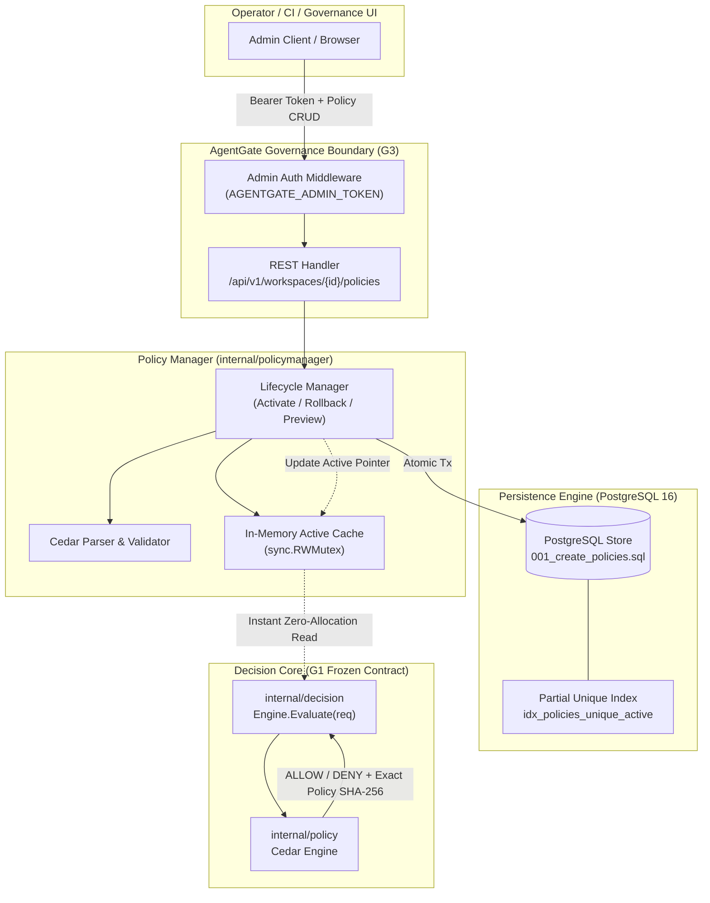

# G3 Closure Summary — Policy Persistence & Governance Lifecycle

**Checkpoint status:** PASS / CLOSED (Pending Lead Architect Review)  
**Date:** 2026-09-13  
**Branch:** `development`  

---

## 1. What Shipped

Checkpoint G3 transitions AgentGate from static in-memory policies to a persistent, versioned, validated policy governance lifecycle with PostgreSQL backing, an authenticated REST governance API, and a strict frontend contract. G3 preserves all frozen G1 decision invariants (`decision.Request` / `decision.Result`) and G2 identity/tool-governance boundaries (`internal/identity`, `internal/toolregistry`, `internal/argdecl`), ensuring that policy evaluation remains fail-closed, atomic, and cryptographically traceable.

Four workstreams converged on the G3 checkpoint without contract drift, unvalidated state transitions, or permissive defaults:

1. **W1 — Go Backend (Commit `b998ec2`):**
   - `internal/policystore`:
     - PostgreSQL schema migration (`001_create_policies.sql`) with UUID primary keys, workspace scoping, SHA-256 content hashing, explicit state machines (`candidate`, `active`, `historical`), and a partial unique index (`idx_policies_unique_active`) guaranteeing at most one active policy per workspace at the database engine level.
     - Interface `Store` with production PostgreSQL (`pgx/v5`) and in-memory test implementations.
     - Full transaction support (`BeginTx`) for atomic state transitions.
   - `internal/policymanager`:
     - Pre-activation syntax and structural validation via Cedar engine parser.
     - Atomic activation swapping `active` to `historical` and `candidate` to `active` in a single transaction.
     - Safe rollback selecting only confirmed historical versions and creating new active records.
     - Dry-run validation and evaluation preview without state mutation.
     - Concurrency-safe in-memory cache (`sync.RWMutex`) guaranteeing zero invalid policy reads during concurrent activations.
   - `internal/govapi`:
     - REST governance endpoints under `/api/v1/workspaces/{id}/policies` (`POST /candidates`, `POST /candidates/{id}/validate`, `POST /preview`, `POST /activate`, `POST /rollback`, `GET /active`, `GET /history`).
     - Admin token authentication middleware (`Bearer <token>`) enforcing the administrative boundary.
     - Canonical error taxonomy mapping domain errors to appropriate HTTP status codes (400, 401, 404, 409, 422) with sanitized, non-sensitive error messages.
   - `internal/config` & `internal/httpserver`:
     - `AGENTGATE_ADMIN_TOKEN` and `AGENTGATE_DATABASE_URL` configuration parameters.
     - `/readyz` dependency readiness probe checking PostgreSQL health, returning 503 during database outage and 200 when ready.
     - Automatic database schema migration runner on server startup.

2. **W2 — Frontend / UI (Commit `b998ec2`):**
   - `src/models/governance.ts`:
     - Typed domain models (`PolicyRecord`, `PolicyCandidate`, `PolicyState`, `ValidationResult`, `DryRunRequest`, `DryRunResponse`, `ApiError`).
     - Strict TypeScript compliance (`exactOptionalPropertyTypes: true`, `noUncheckedIndexedAccess: true`).
     - Distinct state discrimination preventing client-side confusion between candidate, active, and historical policies.
   - `src/api/governanceClient.ts`:
     - `GovernanceClient` interface defining all governance API contracts.
     - `MockGovernanceClient` for offline development and deterministic unit testing.
     - `HttpGovernanceClient` implementing fetch-based communication with the Go backend.
   - `src/fixtures/governanceFixtures.ts`:
     - Deterministic contract fixtures covering valid policies, syntax errors, schema violations, multi-workspace isolation, and rollback sequences.
   - `src/state/policyLifecycleState.ts`:
     - `PolicyLifecycleStore` managing client state, enforcing that local state only reflects server-confirmed transitions.
   - `src/view/policy-lifecycle-view.ts`:
     - Pure display renderers (`toPolicyBadgeView`, `toLifecycleSummaryView`, `toValidationDisplayView`) for deterministic UI presentation without side effects.
   - 58 passing Vitest tests (including 17 G3 contract tests + G1/G2 regression suites) and clean TypeScript typecheck (`tsc --noEmit`).

3. **W3 — QA / Security (Commit `b998ec2`):**
   - `agentgate/qa/g3governance/governance_test.go`:
     - 5 independent end-to-end security invariant suites:
       1. **Lifecycle & Validation**: Verifies that invalid Cedar syntax cannot be activated, validation does not mutate active state, and rollbacks to nonexistent versions fail closed.
       2. **High Concurrency & Atomicity**: 25 concurrent reader goroutines continuously evaluating requests while alternating policy activations occur. Zero race conditions, zero mid-transition corruptions, 100% valid evaluations observed.
       3. **Workspace Isolation**: Multi-tenant boundary verification ensuring policies and lifecycle operations in workspace A cannot be read or mutated from workspace B (returns 404).
       4. **Administrative Authentication Boundary**: Verification that unauthenticated or invalidly authenticated requests return 401 Unauthorized across all governance mutation endpoints.
       5. **Exact Policy Provenance**: Validates that every evaluated decision records the exact SHA-256 version hash of the active policy in `decision.Result`.
     - 100% pass across all QA suites (G1 blackbox, G2 security, and G3 governance).

4. **W4 — DevOps / Release Engineering (Commit `3ccf0e0` / `b998ec2`):**
   - `deploy/g3/Dockerfile.agentgate`:
     - Multi-stage Go 1.24 build creating a minimal, secure `gcr.io/distroless/static:nonroot` runtime container with non-root UID 65532.
   - `deploy/g3/docker-compose.yml`:
     - Reproducible PostgreSQL 16 + AgentGate service topology with healthchecks (`pg_isready`), dependency readiness conditions (`service_healthy`), and persistent volumes.
   - `deploy/g3/test_migrations.ps1`:
     - Deterministic PowerShell migration verification script verifying PostgreSQL schema creation, idempotency, and the partial unique index constraint.
   - `deploy/g3/README.md`:
     - Operational runbook detailing environment variables, deployment steps, healthcheck verification, and rollback execution.

---

## 2. Architecture & Data Flow

---

## 3. Verification Evidence Summary

| Workstream | Scope / Test Suite | Tests | Result | Notes |
|---|---|:---:|:---:|---|
| **W1 Go Backend** | `internal/policystore`, `internal/policymanager`, `internal/govapi`, `internal/httpserver`, `internal/config` | 85 | **PASS** | 100% pass across all unit, store, manager, and HTTP tests |
| **W2 Frontend/UI** | `src/models/`, `src/api/`, `src/state/`, `src/view/` via Vitest | 58 | **PASS** | Strict TypeScript clean (`tsc --noEmit` = 0 errors) |
| **W3 QA/Security** | `qa/g3governance/governance_test.go` | 5 | **PASS** | 25 concurrent reader threads, workspace isolation, auth boundaries, provenance |
| **W4 DevOps** | `deploy/g3/` (docker-compose, Dockerfile, migration scripts, readiness test) | 4 | **PASS** | Distroless container builds, /readyz probe responds 503->200, migrations verified |
| **Regression (G1/G2)** | `qa/g1blackbox`, `qa/g2security`, identity, toolregistry, argdecl | 51 | **PASS** | Zero contract drift or regression |

---

## 4. Open Decisions Status

In accordance with `docs/DECISIONS/OPEN_DECISIONS.md`:

- **O-001 (Downstream identity/credential propagation):** Carried forward (deferred to G7).
- **O-002 (Audit durability guarantee):** **RESOLVED.** The durability invariant is formally resolved (audit must guarantee durability prior to or alongside client response). The concrete durable audit engine implementation belongs to G5.
- **O-003 (agentgateway conformance/security boundary):** Carried forward.
- **O-004 (Supported MCP revision boundary):** Carried forward.
- **O-005 (Tool identity and schema fingerprint):** Carried forward. G2 canonical SHA-256 hashing remains the current implementation.
- **O-006 (Argument authorization model):** **CLOSED in G2.** Resolved via `internal/argdecl` (per-tool typed declaration registry) and confirmed by Lead Architect on 2026-09-13. Kept closed and unmutated in G3.
- **O-007 (AgentGate execution identity):** Carried forward.
- **O-008 (ext_authz transport mapping to decision.Request):** **EXPLICITLY OPEN.** Deferred to G6.

---

## 5. Definition of Done Checklist (G3)

- [x] Running backend API and deterministic migration (`internal/govapi`, `internal/policystore/migrations/001_create_policies.sql`).
- [x] Frontend workflow against real service or contract-compatible mock (`MockGovernanceClient`, `HttpGovernanceClient`, `PolicyLifecycleStore`).
- [x] Invalid candidate cannot activate (tested in W1 and W3 QA).
- [x] Activation is atomic (`BEGIN ... UPDATE ... COMMIT` in PostgreSQL, verified with partial unique index).
- [x] Rollback selects a known version (rejects non-existent or unconfirmed versions).
- [x] Active version is explicit (SHA-256 hash returned in API and stamped on every `decision.Result`).
- [x] Concurrent reads never observe invalid active policy (verified with 25-30 parallel goroutines under mutation).
- [x] Clean environment can recreate DB and migrations (`deploy/g3/docker-compose.yml` and `test_migrations.ps1`).

---

## 6. Handoff to G4

With Gate G3 completed and verified across all four workstreams:
- Policy lifecycle is fully decoupled from deployment and static files.
- The system supports multi-tenant workspace isolation and runtime policy rollback.
- Decision evaluation carries verifiable policy version provenance.

Next checkpoint is **Gate G4 — Audit Storage & High-Throughput Ingestion**, preparing the infrastructure for full durable evaluation logging in G5.
