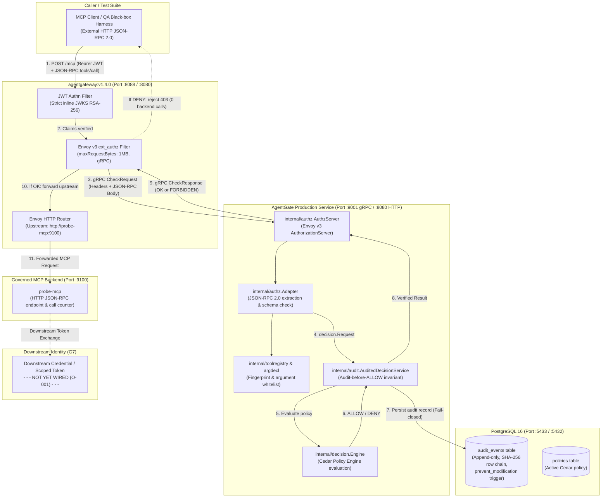

# G6 Closure Summary — Real MCP End-to-End Enforcement

**Checkpoint status:** PASS / CLOSED / FROZEN  
**Date:** 2026-09-16  
**Implementation Commits:** `cd37bb5`, `f3aa8ed`, `08989db`, `449aa2d`  

---

## 1. What shipped

AgentGate can now enforce Cedar authorization decisions in-line against real Model Context Protocol (MCP) tool call traffic entering through a real reverse proxy (`agentgateway:v1.4.0`), persisting durable, tamper-evident audit records before returning an authorization response, and routing only permitted requests to a downstream MCP backend. 

Prior to G6, AgentGate's Cedar decision engine, tool registry, and PostgreSQL audit persistence operated behind test mocks or standalone unit harnesses without live proxy integration (tracked under architectural gap **O-008**). With G6, AgentGate exposes a production-grade Envoy v3 external authorization (`ext_authz`) gRPC service on `:9001` that unmarshals incoming JSON-RPC 2.0 `tools/call` payloads, checks registered tool schemas and typed argument whitelists, verifies JWT caller identity, and evaluates policy. 

This end-to-end enforcement boundary is independently proven by a black-box test suite (`agentgate/qa/g6enforcement`) running against the live multi-container topology: across 12 mandatory DoD failure, denial, and outage scenarios, exactly **0** calls reached the MCP backend fixture, while a valid, authorized tool call produced exactly **1** backend call. Live outage testing proved the gateway fails closed (0 backend calls) when AgentGate is stopped, and recovers cleanly (1 backend call) upon restart. Furthermore, every decision was verified as durably written to PostgreSQL with unbroken SHA-256 cryptographic row chaining.

---

## 2. Codebase walkthrough

### 2.1 System Architecture & Data Flow

*Note on Downstream Identity:* The dotted connection to Downstream Identity highlights that token exchange / downstream scoped credentials are not yet implemented and remain open under **O-001** for Gate G7. The inbound client token is never forwarded downstream.

---

### 2.2 New & Modified Components

| Location | Purpose |
|---|---|
| `agentgate/internal/authz/types.go` | Data types for Envoy v3 `ext_authz` adapter, JSON-RPC 2.0 requests, and `DecisionService` interface. |
| `agentgate/internal/authz/adapter.go` | Translates Envoy v3 `CheckRequest` into frozen `decision.Request`, enforcing tool governance, schema drift detection, argument whitelisting, and JWT identity mapping. |
| `agentgate/internal/authz/adapter_test.go` | Unit test suite verifying adapter extraction, validation errors, null argument rejection, and fail-closed behaviors. |
| `agentgate/internal/authz/server.go` | Production Envoy v3 gRPC `AuthorizationServer` implementation with fail-closed error handling and audit recording. |
| `agentgate/internal/authz/server_test.go` | Unit test suite exercising gRPC `Check()` under ALLOW, DENY, adaptation failure, and internal error conditions. |
| `agentgate/cmd/agentgate/main.go` | Wires the gRPC `ext_authz` server on `:9001` alongside HTTP health endpoints, seeds default policies, registers tools, and initializes PostgreSQL audited decision service. |
| `agentgate/internal/config/config.go` | Added `AuthzGRPCAddr` configuration parameter (default `:9001`). |
| `agentgate/internal/audit/postgres.go` | Fixed SQL parameter casting (`$1::text`) to resolve SQLSTATE `42P08` on sequence numbering. |
| `agentgate/qa/g6enforcement/` | Black-box E2E security test suite validating all 12 mandatory DoD scenarios, zero internal imports. |
| `deploy/g6/agentgateway.yaml` | Pinned `agentgateway` configuration with strict JWT authentication, `policies.extAuthz` targeting `agentgate:9001`, and full body capture. |
| `deploy/g6/docker-compose.yml` | Integrated 4-service topology (`g6-postgres`, `g6-agentgate`, `g6-agentgateway`, `g6-probe-mcp`) on `g6net` with host port mapping `5433:5432` for PostgreSQL. |
| `deploy/g6/init-g6-db.sql` | PostgreSQL initialization script creating schemas, immutability triggers, and G5 privilege separation (`agentgate_migrator` / `agentgate_app`). |
| `deploy/g6/Dockerfile.agentgate` | Multi-stage Dockerfile packaging production `cmd/agentgate` binary. |
| `deploy/g6/run-e2e-matrix.ps1` | Automated test runner provisioning the topology, executing the 12 scenarios, testing live outages, and verifying audit logs. |

---

### 2.3 Key Design Decisions & Rationale

1. **Native Envoy v3 gRPC ext_authz (not HTTP webhook):**  
   *Why:* `agentgateway` implements the Envoy external authorization protocol natively via gRPC (`envoy.service.auth.v3.Authorization/Check`). Using gRPC provides strong typing, lower latency, and seamless protocol alignment with standard service-mesh ingress.
2. **Strict In-Process Adapter Boundary (`internal/authz` calling `decision.Engine` via `audit.AuditedDecisionService`):**  
   *Why:* Keeps `internal/decision` completely decoupled from Envoy protobufs and JSON-RPC structures. The adapter translates external wire payloads into the immutable `decision.Request` contract frozen in G1.
3. **Audit-Before-ALLOW Invariant Preserved in In-Line Path:**  
   *Why:* Resolving O-002 in G5 established that no ALLOW may be returned unless durably persisted in PostgreSQL. In G6, `server.go` calls `AuditedDecisionService.Evaluate()`, ensuring that any database persistence failure automatically turns an ALLOW into a DENY before the gateway can proxy to the backend.
4. **Tool Governance & Argument Whitelist Enforcement Pre-Evaluation:**  
   *Why:* Resolving O-006 in G2 established that undeclared arguments or schema drift must not reach policy evaluation. The adapter validates tool name and arguments against `toolregistry` and `argdecl` before Cedar evaluation, preventing parameter tampering or injection attacks.

---

### 2.4 Trade-offs & Known Rough Edges

- **Local Windows Smart App Control / Temp Binaries:**  
  On Windows systems with Smart App Control or Device Guard enabled, temporary test binaries built in `%TEMP%` by `go test` can be blocked. In PowerShell, tests should use a project-local temp directory (`$env:GOTMPDIR = "$PWD\.tmp"`), or execute inside the Docker container harness (`deploy/g6/run-e2e-matrix.ps1`).
- **Postgres Host Port Collision:**  
  To avoid conflict with local databases on port 5432, the Compose file maps host port `5433:5432`. Inside the Docker network (`g6net`), all containers connect to `postgres:5432`.
- **Downstream Identity Passthrough Deferred to G7:**  
  In G6, `agentgateway` forwards the request to `probe-mcp` without downstream token exchange (O-001). The inbound bearer token is verified at the gateway and consumed by AgentGate, but downstream credential minting will be addressed in G7.

---

## 3. Where to look

To understand the G6 implementation and contract enforcement, inspect these files in order:

1. [`agentgate/internal/authz/adapter.go`](file:///d:/PROJECTS/AgentGate_Hackathon/agentgate-repo/agentgate/internal/authz/adapter.go) — The translation boundary converting Envoy v3 `CheckRequest` into frozen `decision.Request`.
2. [`agentgate/internal/authz/server.go`](file:///d:/PROJECTS/AgentGate_Hackathon/agentgate-repo/agentgate/internal/authz/server.go) — The production gRPC service enforcing fail-closed outcomes and durable audit integration.
3. [`deploy/g6/agentgateway.yaml`](file:///d:/PROJECTS/AgentGate_Hackathon/agentgate-repo/deploy/g6/agentgateway.yaml) — The gateway configuration binding strict JWT authentication and ext_authz callouts.
4. [`agentgate/qa/g6enforcement/enforcement_test.go`](file:///d:/PROJECTS/AgentGate_Hackathon/agentgate-repo/agentgate/qa/g6enforcement/enforcement_test.go) — The independent black-box test suite verifying all 12 mandatory security scenarios.
5. [`deploy/g6/run-e2e-matrix.ps1`](file:///d:/PROJECTS/AgentGate_Hackathon/agentgate-repo/deploy/g6/run-e2e-matrix.ps1) — The clean-environment orchestration harness proving the full stack end-to-end.

---

## 4. Decisions and carried-forward items

### 4.1 Decisions Resolved During G6
- **O-008 (ext_authz transport mapping to decision.Request contract):** Formally resolved and proven against `agentgateway:v1.4.0`. Complete JSON-RPC 2.0 payload is delivered via `CheckRequest.Attributes.Request.Http.Body`, authenticated identity via `MetadataContext`, and mapped into `decision.Request`.
- **O-003 (agentgateway conformance/security boundary):** Formally resolved. Conformance verified through black-box E2E testing against pinned binary `v1.4.0` across 12 failure/denial scenarios, live outage fail-closed, and live service recovery.

### 4.2 Carried Forward to Subsequent Checkpoints
- **O-001 (Downstream identity / credential propagation):** Critical priority for Gate G7. AgentGate must establish scoped downstream credentials rather than forwarding the inbound bearer token.
- **O-004 (Supported MCP revision):** High priority. Pinned fixture uses MCP `tools/call` JSON-RPC 2.0. Formal negotiation of multiple MCP revisions will be finalized in future milestones.
