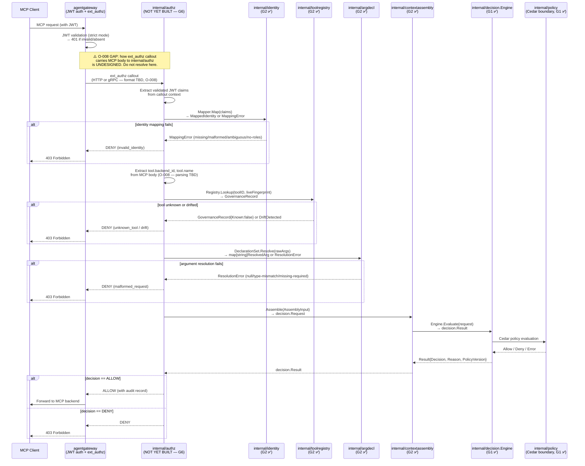

# G2 Gateway/MCP — G6 Handoff Specification (G2-GW-06)

**Date:** 2026-09-13  
**Purpose:** Document the intended authorization sequence for the G6 gateway-integration checkpoint.  
**O-008 Status:** **EXPLICITLY OPEN.** The mechanism by which an ext_authz callout becomes a `decision.Request` is undesigned. This document describes the *intended sequence*, not a resolved design.

---

## Overview

G6 will wire the real `internal/authz` gRPC/HTTP service to `agentgateway`'s ext_authz callout, closing the O-008 gap. This document specifies what each hop must produce, what the next hop needs, and where the open gap lies.

---

## Intended sequence

---

## Per-hop contract

### Hop 1: MCP Client → agentgateway
- **Input**: MCP request with JWT in `Authorization: Bearer` header
- **agentgateway's job**: JWT signature validation, audience/issuer check
- **Output to next hop**: validated claims (mechanism TBD — O-003, O-008), raw MCP body

### Hop 2: agentgateway → internal/authz (ext_authz callout)
- **⚠️ O-008 GAP**: format of callout undesigned
- **What internal/authz needs** from this hop:
  - Pre-validated JWT claims (as a `map[string]string` for `identity.Mapper`)
  - Raw MCP request body (to extract `tool.backend_id`, `tool.name`, raw arguments)
  - A correlation/execution ID (for `decision.Request.ExecutionID`)
  - Workspace scoping context (for `decision.Request.WorkspaceID`)
- **Most plausible approach** (hypothesis): `internal/authz` reads the raw body from the callout and parses it into a `decision.Request` via `internal/mcpreq` (per `docs/PROJECT_DEFINITION.md §11`). NOT a decision.

### Hop 3: internal/authz → internal/identity
- **Input**: `map[string]string` of gateway-validated claims
- **Contract**: `identity.Mapper.Map(claims)` → `MappedIdentity` or `*MappingError`
- **G2 status**: ✅ Implemented and tested

### Hop 4: internal/authz → internal/toolregistry
- **Input**: `toolregistry.ToolID{BackendID, ToolName}` + optional live schema fingerprint
- **Contract**: `Registry.Lookup(id, liveFingerprint)` → `GovernanceRecord`
- **G2 status**: ✅ Implemented and tested

### Hop 5: internal/authz → internal/argdecl
- **Input**: `map[string]json.RawMessage` of raw tool arguments + `DeclarationSet` for this tool
- **Contract**: `DeclarationSet.Resolve(raw)` → `map[string]ResolvedArg` or `*ResolutionError`
- **G2 status**: ✅ Implemented and tested

### Hop 6: internal/authz → internal/contextassembly → decision.Engine
- **Input**: `MappedIdentity` + `GovernanceRecord` + `map[string]ResolvedArg`
- **Contract**: `contextassembly.Assemble(AssemblyInput)` → `decision.Request`; then `Engine.Evaluate(request)` → `decision.Result`
- **G2 status**: ✅ Implemented and tested (end-to-end in `TestAssemble_FeedsDecisionEngine`)

---

## Open items for G6

1. **O-008**: Design `internal/authz`'s ext_authz transport handling — HTTP or gRPC, body inclusion mechanism.
2. **O-003**: Verify agentgateway's actual claim forwarding behavior against real binary with signed JWT.
3. **O-004**: Confirm MCP protocol revision for body parsing.
4. **Audit durability**: `DENY / ALLOW` must both produce a durable audit record before the response is returned (O-002, resolved invariant).
5. **Execution ID generation**: Who generates `ExecutionID`? Likely `internal/authz` on callout receipt.
